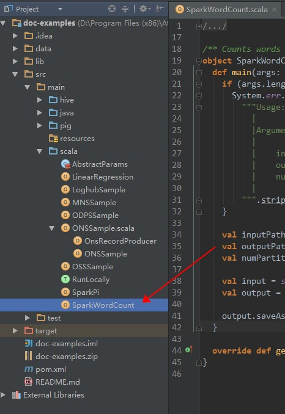
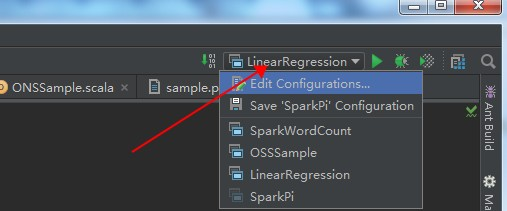
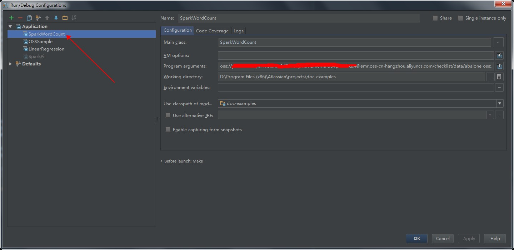
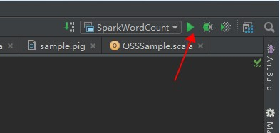
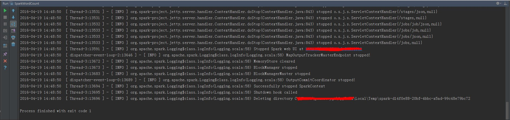
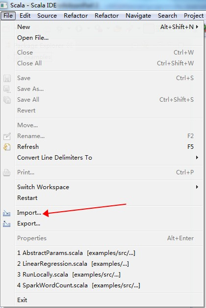
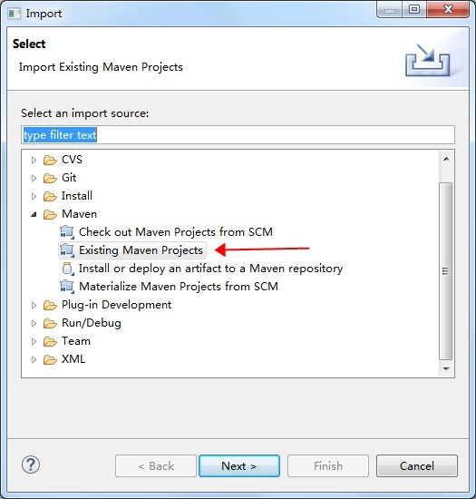
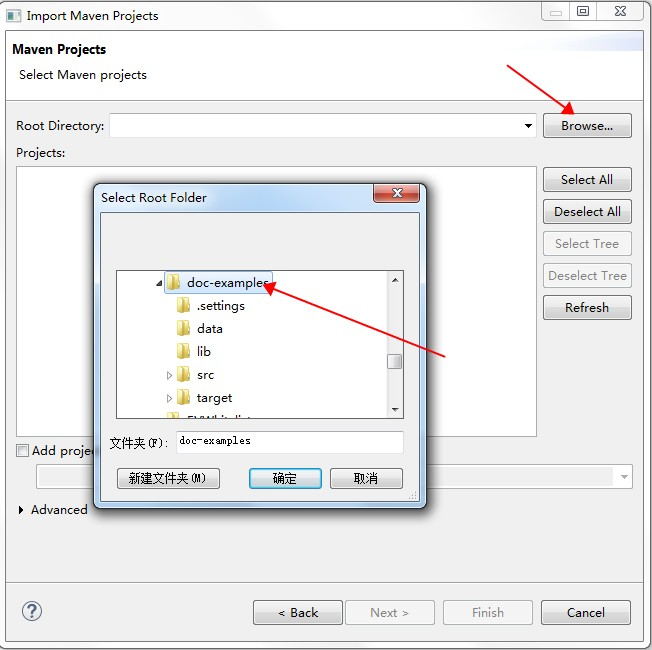
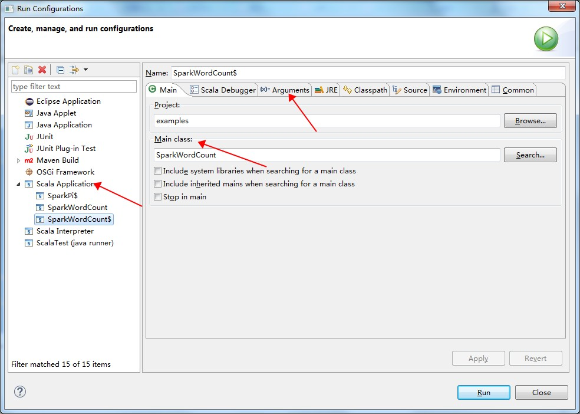
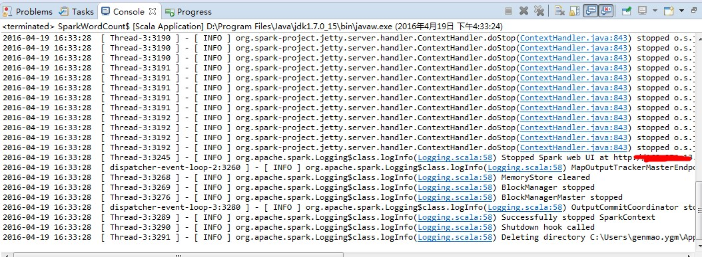

## 本项目包含以下示例：

#### MapReduce

- WordCount： 单词统计

#### Hive

- sample.hive：表的简单查询

#### Pig

- sample.pig：Pig处理OSS数据实例

#### Spark

- SparkPi: 计算Pi
- SparkWordCount： 单词统计
- LinearRegression： 线性回归
- OSSSample： OSS使用示例
- ONSSample： ONS使用示例
- ODPSSample： ODPS使用示例
- MNSSample：MNS使用示例
- LoghubSample：Loghub使用示例 

#### PySpark

- WordCount: 单词统计

## 依赖资源

测试数据（data目录下）：

- The_Sorrows_of_Young_Werther.txt：可作为WordCount（MapReduce/Spark）的输入数据
- patterns.txt：WordCount（MapReduce）作业的过滤字符
- u.data：sample.hive脚本的测试表数据
- abalone：线性回归算法测试数据

依赖jar包（lib目录下）

- tutorial.jar：sample.pig作业需要的依赖jar包

## 准备工作

本项目提供了一些测试数据，您可以简单地将其上传到OSS中即可使用。其他示例，例如ODPS，MNS，ONS和Loghub等等，需要您自己准备数据如下：

- 【可选】 创建LogStore，参考[日志服务用户指南](https://help.aliyun.com/document_detail/sls/user-guide/overview.html?spm=5176.docsls/user-guide/consume-logs.3.2.VW5TNb)。
- 【可选】 创建ODPS项目和表，参考[ODPS快速开始](https://help.aliyun.com/document_detail/odps/quick_start/prerequisite.html?spm=5176.docodps/quick_start/prerequisite.3.2.OqBkc4)。
- 【可选】 创建ONS，参考[消息队列快速开始](https://help.aliyun.com/document_detail/ons/quick-start/apply.html?spm=5176.docons/quick-start/send.3.2.eZ8h7p)。
- 【可选】 创建MNS，参考[消息服务控制台使用帮助](https://help.aliyun.com/document_detail/mns/help_of_console/AccessMNSBySubUser.html?spm=5176.docmns/help_of_console/help_of_queue/CreateQueue.3.2.0Sj96I)。

## 基本概念：

- OSSURI： **oss**://accessKeyId:accessKeySecret@bucket.endpoint/a/b/c.txt，用户在作业中指定输入输出数据源时使用，可以类比hdfs://。
- 阿里云AccessKeyId/AccessKeySecret是您访问阿里云API的密钥，你可以在[这里](https://ak-console.aliyun.com/#/accesskey)获取。

## 集群运行

- Spark
	- SparkWordCount： `spark-submit --class SparkWordCount examples-1.0-SNAPSHOT-shaded.jar <inputPath> <outputPath> <numPartition>`
		- inputPath： 输入数据路径
		- outputPath： 输出路径
		- numPartition： 输入数据RDD分片数目
	- SparkPi： `spark-submit --class SparkPi examples-1.0-SNAPSHOT-shaded.jar`
	- OSSSample：`spark-submit --class OSSSample examples-1.0-SNAPSHOT-shaded.jar <inputPath> <numPartition>`
		- inputPath: 输入数据路径
		- numPartition：输入数据RDD分片数目
	- ONSSample： `spark-submit --class ONSSample examples-1.0-SNAPSHOT-shaded.jar <accessKeyId> <accessKeySecret> <consumerId> <topic> <subExpression> <parallelism>`
		- accessKeyId： 阿里云AccessKeyId
		- accessKeySecret：阿里云AccessKeySecret
		- consumerId: 参考[Consumer ID说明](https://help.aliyun.com/document_detail/ons/brief-manual/terminology.html?spm=5176.docons/brief-manual/overview.6.87.F8suBu)
		- topic: 每个消息队列都有一个topic
		- subExpression: 参考[消息过滤](https://help.aliyun.com/document_detail/ons/user-guide/tag-filter.html?spm=5176.docons/tcp/java-sdk/normal-consumer.6.97.PIqsEo)。
		- parallelism：指定多少个接收器来消费队列消息。
	- ODPSSample: `spark-submit --class ODPSSample examples-1.0-SNAPSHOT-shaded.jar <accessKeyId> <accessKeySecret> <envType> <project> <table> <numPartitions>`
		- accessKeyId： 阿里云AccessKeyId
		- accessKeySecret：阿里云AccessKeySecret
		- envType： 0表示公网环境，1表示内网环境。如果是本地调试选择0，如果是在E-MapReduce上执行请选择1。
		- project：参考[ODPS-快速开始](https://help.aliyun.com/document_detail/odps/quick_start/prerequisite.html?spm=5176.docodps/summary/glossary.6.90.inv9Ph)。
		- table：参考[ODPS术语介绍](https://help.aliyun.com/document_detail/odps/summary/glossary.html?spm=5176.docodps/quick_start/prerequisite.6.88.A5zVKu)。
		- numPartition：输入数据RDD分片数目
	- MNSSample: `spark-submit --class MNSSample examples-1.0-SNAPSHOT-shaded.jar <queueName> <accessKeyId> <accessKeySecret> <endpoint>`
		- queueName：队列名，[参考MNS名词解释](https://help.aliyun.com/document_detail/mns/introduction/product-name-interpretation.html?spm=5176.docmns/help_of_console/help_of_queue/CreateQueue.6.87.lHtPvO)。
		- accessKeyId： 阿里云AccessKeyId
		- accessKeySecret：阿里云AccessKeySecret
		- endpoint：队列数据访问地址 
	- LoghubSample: `spark-submit --class LoghubSample examples-1.0-SNAPSHOT-shaded.jar <sls project> <sls logstore> <loghub group name> <sls endpoint> <access key id> <access key secret> <batch interval seconds>`
		- sls project: LogService项目名
		- sls logstore： 日志库名
		- loghub group name：作业中消费日志数据的组名，可以任意取。sls project，sls store相同时，相同组名的作业会协同消费sls store中的数据；不同组名的作业会相互隔离地消费sls store中的数据。
		- sls endpoint： 参考[日志服务入口](https://help.aliyun.com/document_detail/sls/api/endpoints.html?spm=5176.docsls/user-guide/concept.6.134.Gy05tN)。
		- accessKeyId： 阿里云AccessKeyId
		- accessKeySecret：阿里云AccessKeySecret
		- batch interval seconds： Spark Streaming作业的批次间隔，单位为秒。
	- LinearRegression: `spark-submit --class LinearRegression examples-1.0-SNAPSHOT-shaded.jar <inputPath> <numPartitions>`
		- inputPath：输入数据
		- numPartition：输入数据RDD分片数目 

- PySpark
	- WordCount： `spark-submit wordcount.py <inputPath> <outputPath> <numPartition>`
		- inputPath： 输入数据路径
		- outputPath： 输出路径
		- numPartition： 输入数据RDD分片数目

- Mapreduce
	- WordCount： `hadoop jar examples-1.0-SNAPSHOT-shaded.jar WordCount -Dwordcount.case.sensitive=true <inputPath> <outputPath> -skip <patternPath>`
		- inputPathl：输入数据路径
		- outputPath：输出路径
		- patternPath：过滤字符文件，可以使用data/patterns.txt

- Hadoop Streaming
	- WordCount： `hadoop jar /usr/lib/hadoop-current/share/hadoop/tools/lib/hadoop-streaming-*.jar -file <mapperPyFile> -mapper mapper.py -file <reducerPyFile> -reducer reducer.py -input <inputPath> -output <outputPath>`
		- mapperPyFile mapper文件，[mapper样例](/src/main/python/streaming/wcmapper.py)
		- reducerPyFile reducer文件, [reducer样例](/src/main/python/streaming/wcreducer.py)
		- inputPath：输入数据路径
		- outputPath：输出路径

- Hive
	- `hive -f sample.hive -hiveconf inputPath=<inputPath>`
		- inputPath：输入数据路径

- Pig
	- `pig -x mapreduce -f sample.pig -param tutorial=<tutorialJarPath> -param input=<inputPath> -param result=<resultPath>`
		- tutorialJarPath：依赖Jar包，可使用lib/tutorial.jar
		- inputPath：输入数据路径
		- resultPath：输出路径

- 注意：
	- 如果在E-MapReduce上使用时，请将测试数据和依赖jar包上传到OSS中，路径规则遵循OSSURI定义，见上。
	- 如果集群中使用，可以放在机器本地。

## 本地运行

这里主要介绍如何在本地运行Spark程序访问阿里云数据源，例如OSS等。如果希望本地调试运行，最好借助一些开发工具，例如Intellij IDEA或者Eclipse。尤其是Windows环境，否则需要在Windows机器上配置Hadoop和Spark运行环境，很麻烦。

- Intellij IDEA
	- 前提：安装Intellij IDEA，Maven， Intellij IDEA Maven插件，Scala，Intellij IDEA Scala插件
	- 双击进入SparkWordCount.scala
	  
	- 从下图箭头所指处进入作业配置界面
	 
    - 选择SparkWordCount，在作业参数框中按照所需传入作业参数
      
    - 点击“OK”
    - 点击运行按钮，执行作业
      
    - 查看作业执行日志
      

- Scala IDE for Eclipse
	- 前提：安装Scala IDE for Eclipse，Maven，Eclipse Maven插件
	- 导入项目
	  
      
      
    - Run As Maven build，快捷键是“Alt + Shilft + X, M”；也可以在项目名上右键，“Run As”选择“Maven build”
    - 等待编译完后，在需要运行的作业上右键，选择“Run Configuration”，进入配置页      
    - 在配置页中，选择Scala Application，并配置作业的Main Class和参数等等。
      
    - 点击“Run”
    - 查看控制台输出日志
      
